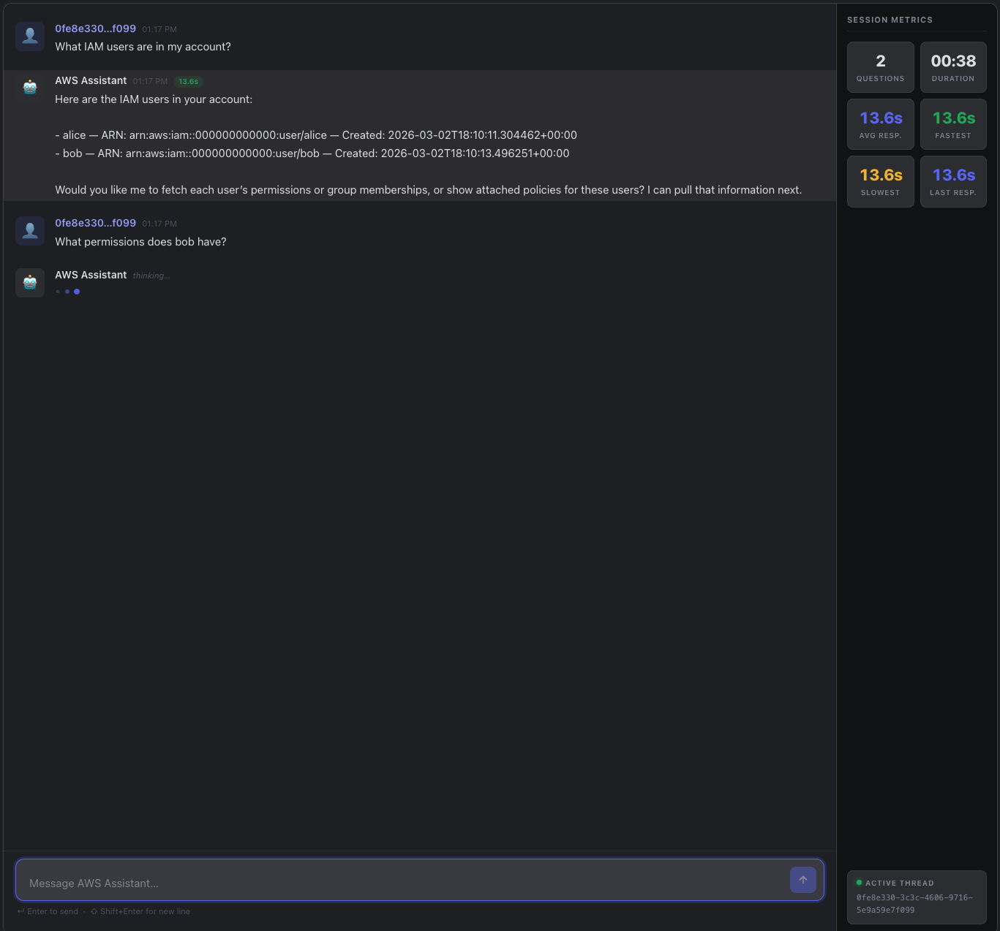

# aws_chatbot

An AI-powered assistant that answers questions about your AWS account. Ask about S3 buckets, IAM users, EC2 instances, and more. The app uses **LocalStack** to mock AWS services locally, so you can explore and test without touching real cloud resources.



## Backend
API listens on `http://localhost:8000/chat` by default. The listener port is configured at runtime by `uvicorn` command.

- **FastAPI** — REST API
- **LangChain** — LLM orchestration and tooling
- **LangGraph** — Agent graph with conversation memory (InMemorySaver)
- **OpenAI** — Chat model (configurable via `MODEL` env var)

## Frontend
Can be accessed at `http://localhost:3000/` by default.

- **Next.js** — React framework with App Router
- **React** — UI components
- **Recharts** — Session metrics and response-time charts

## LocalStack

**LocalStack** mocks AWS services (S3, IAM, EC2) locally in Docker. The chatbot reads account data from LocalStack instead of real AWS, so you can run everything offline with seeded test data. The seed scripts are located in `scripts/localstack/.`. 

## Required `.env` Variables

Create a `.env` file in the project root.

| Variable | Required | Example                  | Notes |
|---|---|--------------------------|---|
| `MODEL` | Yes | `gpt-5-nano-2025-08-07`  | Model name used by LangChain. If no provider prefix is included, code defaults to `openai:`. |
| `OPENAI_API_KEY` | Yes | `sk-...`                 | OpenAI API key. Required when using an OpenAI model. |
| `MODEL_TEMP` | No | `0`                      | Model temperature. Defaults to `0`. |
| `LOG_LEVEL` | No | `DEBUG`                  | App log level. Defaults to `INFO`. |
| `USE_LOCALSTACK` | No | `true`                   | Set to `true` to use LocalStack endpoints. Defaults to `false`. |
| `LOCALSTACK_URL` | No | `http://localstack:4566` | LocalStack endpoint used when `USE_LOCALSTACK=true`. Defaults to `http://localhost:4566` if unset. |
| `AWS_REGION` | No | `us-east-1`              | AWS region. Defaults to `us-east-1` if unset. |
| `AWS_PROFILE` | No | `default`                | Optional profile for real AWS usage (not LocalStack). |
| `AWS_ACCESS_KEY_ID` | No | `test`                   | Used for LocalStack clients when `USE_LOCALSTACK=true`. |
| `AWS_SECRET_ACCESS_KEY` | No | `test`                   | Used for LocalStack clients when `USE_LOCALSTACK=true`. |

- Set `OPENAI_API_KEY` for OpenAI models.

## Start with Docker Compose

```bash
docker compose up -d
```
- Builds the docker images for `chatbot` and `webchat`, if they do not exist. Can also add `--build` if an image does not build automatically.
- Make sure you wait for the seed script to finish seeding localstack with data. View the logs once services are up! 

Check status:
```bash
docker compose ps
```

Follow logs:
```bash
docker compose logs -f
```
- Views logs for all services (e.g. `localstack`, `chatbot`). 
- Seed script is finished when it shows `Ready`. 

Webchat URL:
```text
http://localhost:3000
```
Backend URL:
```text
http://localhost:8000
```

Bring down the network and services:
```bash
docker compose down
```

## Tests with `curl` and example outputs

### 1) New conversation (payload `user_id`)

```bash
curl -sS http://localhost:8000/chat \
  -H "Content-Type: application/json" \
  -d '{
    "user_id": "demo-user-1",
    "query": "What s3 buckets exist?"
  }' | jq -r .answer
```
Output:
```text
Here are the S3 buckets that exist in your account, with high-level policy/ACL details:

- data-bucket
  - Policy: none
  - ACL: FULL_CONTROL granted to a single canonical user (ID: 75aa57f0…).
  - Public access: not explicitly allowed via policy or ACL.

- private-bucket
  - Policy: none
  - ACL: FULL_CONTROL granted to a single canonical user (ID: 75aa57f0…).
  - Public access: not explicitly allowed via policy or ACL.

- private-bucket-2
  - Policy: none
  - ACL: FULL_CONTROL granted to a single canonical user (ID: 75aa57f0…).
  - Public access: not explicitly allowed via policy or ACL.

- private-bucket-3
  - Policy: none
  - ACL: FULL_CONTROL granted to a single canonical user (ID: 75aa57f0…).
  - Public access: not explicitly allowed via policy or ACL.

- public-bucket
  - Policy: yes
    - Statement: AllowPublicRead – Allows s3:GetObject for Principal: * (public) on arn:aws:s3:::public-bucket/*
  - ACL: FULL_CONTROL to canonical user; READ permission granted to AllUsers (public)
  - Public access: Publicly readable due to policy and ACL

- public-bucket-2
  - Policy: yes
    - Statement: AllowPublicRead – Allows s3:GetObject for Principal: * on arn:aws:s3:::public-bucket-2/*
  - ACL: FULL_CONTROL to canonical user; READ permission granted to AllUsers (public)
  - Public access: Publicly readable due to policy and ACL

- public-bucket-3
  - Policy: yes
    - Statement: AllowPublicRead – Allows s3:GetObject for Principal: * on arn:aws:s3:::public-bucket-3/*
  - ACL: FULL_CONTROL to canonical user; READ permission granted to AllUsers (public)
  - Public access: Publicly readable due to policy and ACL
```

### 2) Follow-up in same conversation (same payload `user_id`)

```bash
curl -sS http://localhost:8000/chat \
  -H "Content-Type: application/json" \
  -d '{
    "user_id": "demo-user-1",
    "query": "Which of those are public?"
  }' | jq -r .answer
```

Output:
```text
Public buckets:
- public-bucket
- public-bucket-2
- public-bucket-3

Why: Each has a bucket policy allowing public GetObject (Principal: "*") and their ACLs grant READ to AllUsers. The other buckets (data-bucket, private-bucket, private-bucket-2, private-bucket-3) do not have public access.
```

### 3) Header-based conversation tracking (`x-user-id`)

```bash
curl -sS http://localhost:8000/chat \
  -H "Content-Type: application/json" \
  -H "x-user-id: demo-user-2" \
  -d '{
    "query": "List IAM users."
  }' | jq -r .answer
```

Output:
```text
Here are the IAM users in your account:

- alice
  - ARN: arn:aws:iam::000000000000:user/alice
  - Created: 2026-03-01 20:47:09 UTC
- bob
  - ARN: arn:aws:iam::000000000000:user/bob
  - Created: 2026-03-01 20:47:11 UTC

Total: 2 users.
```

### 4) Follow-up conversation with header (`x-user-id`)

```bash
curl -sS http://localhost:8000/chat \
  -H "Content-Type: application/json" \
  -H "x-user-id: demo-user-2" \
  -d '{
    "query": "What permissions does the user bob have?"
  }' | jq -r .answer
```

Output:
```text
Here are Bob's permissions:

- Inline policies directly on Bob: None
- Policies attached directly to Bob: None
- Groups Bob belongs to: Auditors
- Group policies for Auditors: ReadOnlyAccess attached to the Auditors group
- Inline policies for Auditors: None (per-group)
- Effective permissions: ReadOnlyAccess (through the Auditors group)

In short, Bob has read-only access to AWS resources as defined by the ReadOnlyAccess policy.
```

Important: for follow-up context to work, every request in the same thread must include the same identifier, either:
- `user_id` in the JSON payload, or
- `x-user-id` header.

If neither is provided, the backend generates a random ID and the next request will not have prior context unless you send a stable `user_id` payload parameter or `x-user-id` header.

## Frontend Notes

- The Next.js frontend lives in `frontend/`.
- The webchat uses `user_id` as the conversation thread id.
- The first page load auto-generates a `user_id` and keeps it for the browser session.
- You can switch users by entering a different `user_id`.
- "New chat" clears the current browser session chat and generates a new `user_id`.
- On the backend, `InMemorySaver` keeps old thread history in process memory until the chatbot container restarts.
